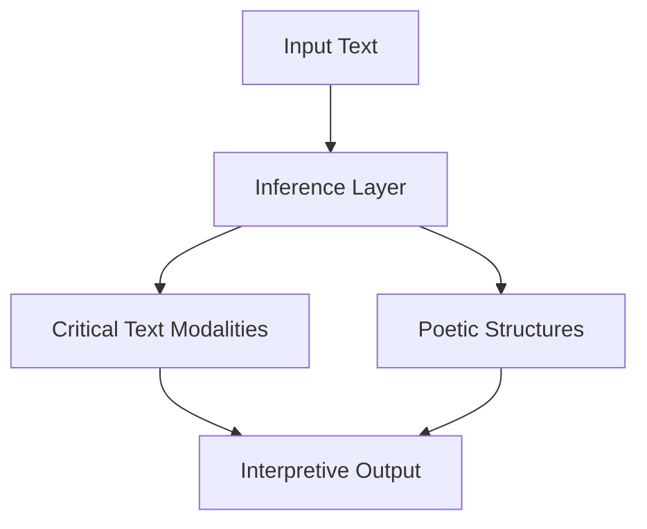

# Alexandria System Diagram

```mermaid
graph TD
    A[Input Text] --> B[Inference Layer]
    B --> C[Critical Text Modalities]
    B --> D[Poetic Structures]
    C --> E[Interpretive Output]
    D --> E
```
